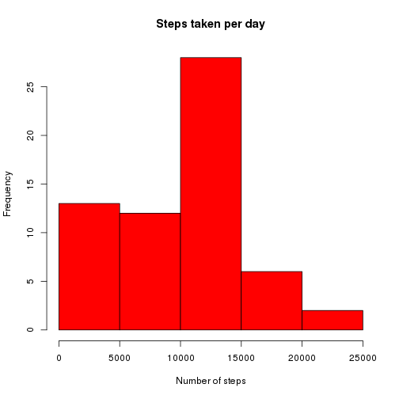
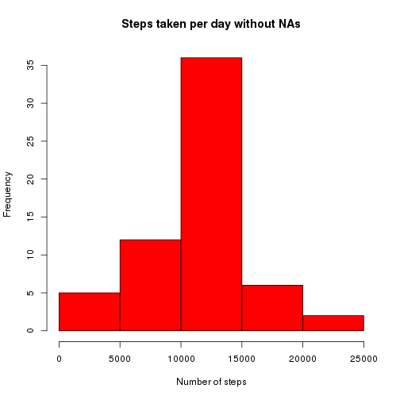
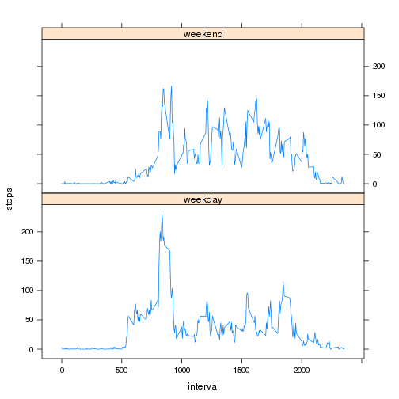

# Reproducible Research: Peer Assessment 1


## Loading and preprocessing the data
First we read the data in the activity.csv file in this directory.

```r
data <- read.csv("activity.csv", header = TRUE)
```
Once we have loaded the data we make sure the date variable is treated as date in R.

```r
data$date <- as.Date(data$date , format="%Y-%m-%d")
```
Print the head of the loaded data.

```r
head(data)
```

```
##   steps       date interval
## 1    NA 2012-10-01        0
## 2    NA 2012-10-01        5
## 3    NA 2012-10-01       10
## 4    NA 2012-10-01       15
## 5    NA 2012-10-01       20
## 6    NA 2012-10-01       25
```

## What is mean total number of steps taken per day?
First let's calculate the number of steps taken per day:

```r
    stepsXday <- aggregate(data$steps, by=list(data$date), sum, na.rm=TRUE)
    names(stepsXday) <- c("date","steps") 
```
This is the histogram for the number of steps x Day :

```r
    hist(stepsXday$steps, main="Steps taken per day",xlab = "Number of steps",col = "red")
```

 

Mean and median of stepsXday are:


```r
mean(stepsXday$steps)
```

```
## [1] 9354
```

```r
median(stepsXday$steps)
```

```
## [1] 10395
```
## What is the average daily activity pattern?
First let's calculate the averaged steps for each interval:

```r
    meanInterval <- aggregate(data$steps, by=list(data$interval), mean, na.rm=TRUE)
    names(meanInterval) <- c("interval","steps")
```

Plotting this data :


```r
    with(meanInterval, plot(interval,steps,type="l",main="Steps x interval averaged per day"))
```

 

The interval with maximum steps across all dates is :


```r
   meanInterval[which.max(meanInterval$steps), ]
```

```
##     interval steps
## 104      835 206.2
```

## Inputing missing values
Finding how number of rows with 'NAs'

```r
   sum(is.na(data$steps))
```

```
## [1] 2304
```

Let's input missing values for steps using the mean at the interval, and store them in a new dataset newData.

```r
newData <- data
for ( i in 1:nrow(newData) ){
    row <- newData[i,]
    if(is.na(newData[i,c("steps")])) {
        newData[i, c("steps")] <- 
            meanInterval[meanInterval$interval == row$interval, c("steps")]
    }
}
```

Calculating steps per day as did to answer the first question but with filled NA values to verify how this affects.


```r
    newStepsXday <- aggregate(newData$steps, by=list(newData$date), sum, na.rm=TRUE)
    names(newStepsXday) <- c("date","steps") 
```

This is the histogram for the number of steps x Day with filled empty values. :


```r
    hist(newStepsXday$steps, main="Steps taken per day without NAs",xlab = "Number of steps",col = "red")
```

 

Mean and median of stepsXday are:


```r
mean(newStepsXday$steps)
```

```
## [1] 10766
```

```r
median(newStepsXday$steps)
```

```
## [1] 10766
```

It's easy to observe how the mean and median values have been changed when the missing information is filled with the mean valur of each interval. Also it's easy to see how the histogram is forming a much smoother gausian density.

## Are there differences in activity patterns between weekdays and weekends?

Let's create the week factor which will tell for each day if it's a weekend or a weekday.

```r
newData$week <- weekdays(newData$date, abbreviate = TRUE)
for ( i in 1:nrow(newData) ){
    row <- newData[i,]
    row$week <- if( row$week == "Mon" || row$week == "Tue" ||
        row$week == "Wed" || row$week == "Thu" ||
        row$week == "Fri" ){
         "weekday"
    }else{
        "weekend"
    }
    newData[i,] <- row
}
```
Now let's plot the average steps per interval for weekdays and for weekend to identify activity patterns between these sets.

```r
require(lattice)
newMeanInterval <- aggregate(newData$steps, by=list(newData$interval,newData$week), mean, na.rm=TRUE)
names(newMeanInterval) <- c("interval","week","steps")
with( newMeanInterval , xyplot( steps ~ interval | week , type="l", layout=c(1,2) ))
```

 

We can observe how the maximum value is higher on weekdays than on weekends, but activity patterns seems to be the same on the steps increases / decreases in similar way.
